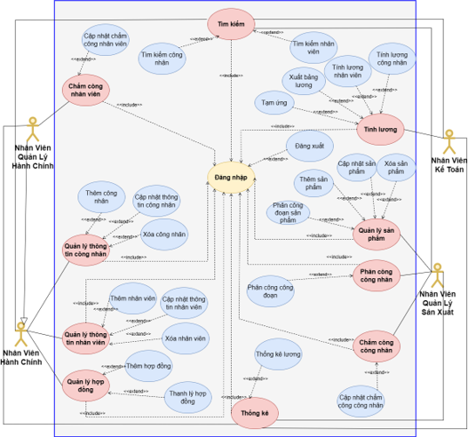
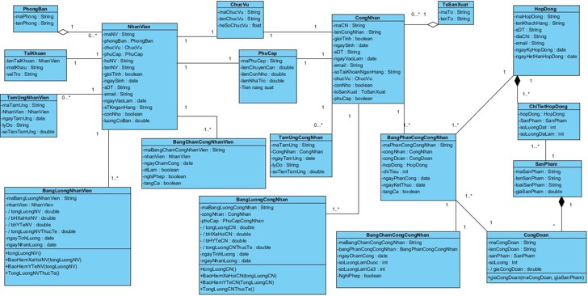
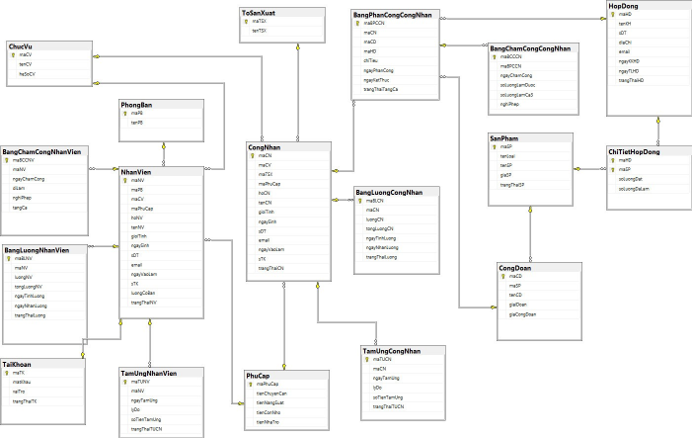
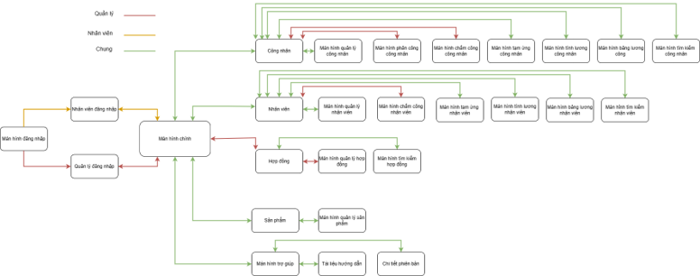
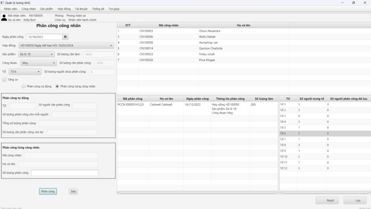
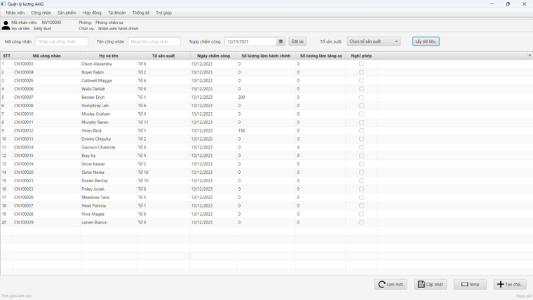
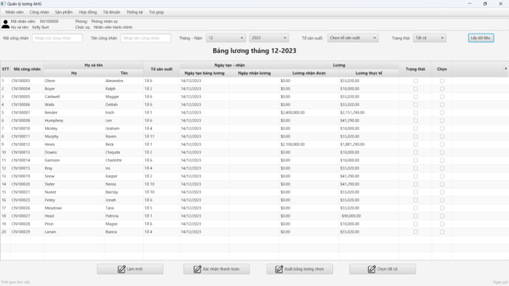
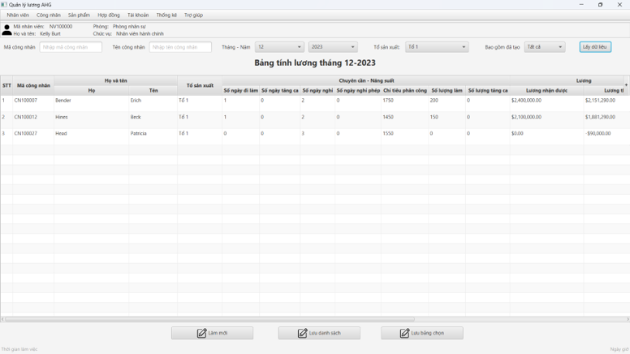
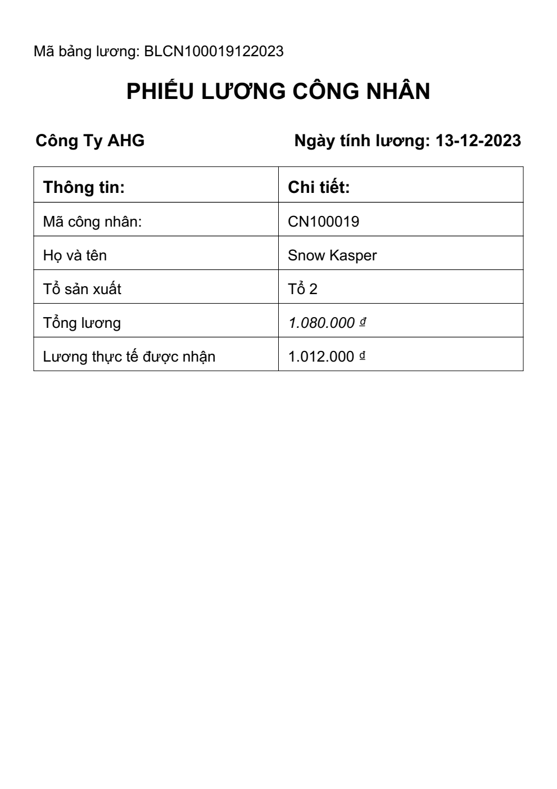

# Phần mềm Quản lý Lương Sản phẩm - Công ty AHG

## Giới thiệu
Phần mềm quản lý lương sản phẩm của công ty ba lô AHG là một hệ thống hỗ trợ quản lý thông tin về lương và sản phẩm cho công nhân một cách hiệu quả, minh bạch và dễ sử dụng. Hệ thống bao gồm các tính năng chính như phân công sản phẩm, chấm công công nhân, và tính toán bảng lương công nhân.

---

## Mô tả tài liệu

### 1. **Use Case Diagram**



### 2. **Class Diagram**



### 3. **Database Diagram**



### 4. **Flow Diagram**



---

## Giao diện

### 1. **Phân Công Sản Phẩm**



### 2. **Chấm Công Công Nhân**



### 3. **Bảng Lương Công Nhân**




### 4. **Phiếu Lương**



---

## Công nghệ sử dụng
- JavaFX, SQL server

---

## Hướng dẫn cài đặt
1. Clone repository về máy:
   ```bash
   git clone https://github.com/JiaG293/QLLSP-AHG.git
   ```
2. Cài đặt các dependencies cần thiết:
   ```bash
   cd QLLSP-AHG
   mvn install # Nếu dùng Java
   ```
3. Cấu hình cơ sở dữ liệu trong file `userData.properties`
4. Chạy ứng dụng:
   ```bash
   mvn javafx:run
   ```

---

## Ghi chú
Phần mềm đang trong giai đoạn phát triển. Một số tính năng có thể thay đổi theo thời gian để đáp ứng nhu cầu thực tế.


